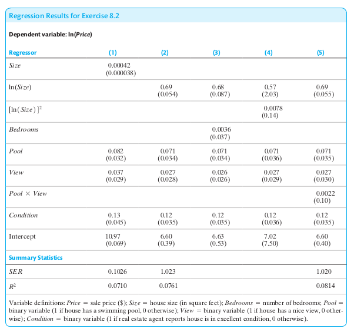

Workshops
=========

The idea of the weekly workshop sessions is to go through some technical analytical exercises
together. A pre-condition for a successful learning experience is that you stay on top of the weekly
lecture material, otherwise the workshop exercises won't make much sense to you.

Our weekly meetings are also an excellent opportunity for you to provide feedback and help me
understand your priorities. Feel free to suggest topics that you would like me to cover. I'm more
than happy to adapt the workshop to reflect your needs and preferences.

Please let me know if you have any other great ideas to turn the weekly workshops into a rewarding
learning experience for you. Let's be open minded throughout and have a continuous conversation on
how to make the workshop suit your needs.

Week 1
------

No exercises in first week. Phew!

Week 2
------

**Exercise 1**

You have available a sample of :math:`n` independently and identically distributed observations
:math:`Y_1, Y_2, \ldots, Y_n` (this is called a **random sample**). Let :math:`E(Y_1) = \mu` and
:math:`Var(Y_1) = \sigma^2` where :math:`\mu` and :math:`\sigma` are placeholders for real numbers.

Now consider the following **weighted average**:

.. math::
        \widetilde{Y} := \big( \tfrac{1}{2} Y_1 + \tfrac{3}{2} Y_2 + \tfrac{1}{2} Y_3 + \tfrac{3}{2}
        Y_4 + \cdots + \tfrac{1}{2} Y_{n-1} + \tfrac{3}{2} Y_n \big) / n,

where :math:`n` is an even number.

Derive the mean and variance of :math:`\widetilde{Y}`. Compare them to the mean and variance of
:math:`\bar{Y}`.

| Attribution:
| This exercise is based on Exercise 3.11 of
| Stock and Watson, *Introduction to Econometrics*, 4th global edition

**Exercise 2**

Assume that grades on a standardized test are known to have a mean of 500 for students in Europe.
The test is administered to 600 randomly selected students in Ukraine; in this sample, the mean is
508, and the standard deviation is 75.

1.  Construct a 95% confidence interval for the average test score for Ukrainian students.

#.  Is there statistically significant evidence that Ukrainian students perform differently than other
    students in Europe?

#.  Another 500 students are selected at random from Ukraine. They are given a 3-hour preparation course
    before the test is administered. Their average test score is 514, with a standard deviation of 65.

    * Construct a 95% confidence interval for the **change in** mean test score associated with the
      prep course.

    * Is there statistically significant evidence that the prep course helped?

| Attribution:
| This exercise is an abbreviated version of Exercise 3.16 of
| Stock and Watson, *Introduction to Econometrics*, 4th global edition

Week 3
------

**Exercise 1**

This exercise provides an example of a pair of random variables, X and Y, for which the conditional
mean of Y given X depends on X yet :math:`\rho_{XY} = 0`.

Let X and Z be two independently distributed standard normal random variables, and let
:math:`Y=X^2+Z`.

1. What are :math:`E(X)`, :math:`E(X^2)`, and :math:`E(X^3)` equal to?

#. Show that :math:`E(Y|X) = X^2`.

#. Show that :math:`E(Y) = 1`.

Parts 2 and 3 show: :math:`E(Y|X) \neq E(Y)`, that is, Y and X are not CMI.

4. Show that :math:`E(XY)=0`.

#. Show that :math:`Cov(X,Y)=0` and therefore :math:`\rho_{XY}=0`.

In the lecture you learned that CMI of two random variables :math:`X` and :math:`Y` implies that
their covariance and correlation are zero. It is important to understand that the converse of that
statement is not true: zero covariance/correlation do not imply CMI.

Panel (d) of Figure 3.3 on page 130 of the textbook illustrates this point (page 140 if you are
using the updated 3rd edition).

| Attribution:
| This exercise is a slightly modified version of Exercise 2.23 of
| Stock and Watson, *Introduction to Econometrics*, 4th global edition

**Exercise 2**

Let's do some least squares estimation.

You have i.i.d. observations :math:`Y_i` for :math:`i=1,\ldots,n`. Your goal is to estimate the
unknown population mean :math:`\mu_Y`. You have learned in the lecture that the best thing you can
do is use the sample average (because it is BLUE). Nevertheless you ignore my advice from the
lecture and you choose a different estimator instead.

You decide to use the least squares estimator

.. math::
    \widehat{\mu}_Y := \text{argmin}_{m} \sum_{i=1}^n (Y_i - m)^2

a)  Arguing intuitively, what is this estimator doing? Does it seem sensible?

b)  Mathematically derive the estimator. Is it unbiased? Is it efficient?

You can look in the textbook on pages 107-108 for clues (pages 115-116 if you are using the
updated 3rd edition).

Week 4
------

**Exercise 1**

Prove the following two facts involving the sum operator. These two facts come in handy when deriving
the OLS estimators from the first order conditions that result from the least squares objective
function (see lecture notes 4).

a)  :math:`\sum_{i=1}^n X_i = n \bar{X}`

    In words: the sum of the :math:`n` values is equal to :math:`n` times the average value.

b)  :math:`\sum_{i=1}^n (X_i - \bar{X}) (Y_i - \bar{Y}) = \left( \sum_{i=1}^n X_i Y_i \right) - n \bar{X} \bar{Y}`

**Exercise 2**

Establish the following algebraic facts about OLS:

a)  The sum of all residuals is zero: :math:`\frac{1}{n} \sum_{i=1}^n \widehat{u}_i = 0`

b)  The average prediction is equal to the sample average: :math:`\frac{1}{n} \sum_{i=1}^n
    \widehat{Y}_i = \bar{Y}`

c)  Residuals and regressors are orthogonal: :math:`\sum_{i=1}^n \widehat{u}_i X_i = 0`

You can look in the textbook on pages 175-176 for clues (pages 190-191 if you are using the updated
3rd edition).

Week 5
------

Show that :math:`\widehat{\beta}_0` is an unbiased estimator of :math:`\beta_0`. (Hint: Use the fact
:math:`\widehat{\beta}_1` is unbiased.)

| Attribution:
| This is Exercise 4.7 of
| Stock and Watson, *Introduction to Econometrics*, 4th global edition

Week 6
------

**Exercise 1**

We are taking a closer look at the regression :math:`R^2`.

a) Show that TSS = ESS + RSS.

b) A simple linear regression yields :math:`\widehat{\beta}_1 = 0`. Show that :math:`R^2=0`.

| Attribution:
| Part b) is Exercise 4.9a of
| Stock and Watson, *Introduction to Econometrics*, 4th global edition

**Exercise 2**

Consider the following alternative regression models:

.. math::

    Y_i &= \beta_0 + \beta_1 X_i + u_i \\
    a \cdot Y_i &= \gamma_0 + \gamma_1 (b \cdot X_i) + v_i \\
    a + Y_i &= \delta_0 + \delta_1 (b + X_i) + w_i,

where :math:`a` and :math:`b` denote nonzero constants.

a)  Show that :math:`\widehat{\gamma}_1 = (a/b) \widehat{\beta}_1` and that
    :math:`\widehat{\gamma}_0 = a \widehat{\beta}_0`.

b)  Show that :math:`\widehat{\delta}_1 = \widehat{\beta}_1` and that
    :math:`\widehat{\delta_0} = \widehat{\beta}_0 + ( a - b \widehat{\beta}_1)`.

(Note: in parts a) and b), Greek letters with *hats* denote OLS estimators.)

What are you learning here? Part a) shows that multiplying the data by constants does change
both the OLS estimates of the slope :math:`\widehat{\gamma}_1` and the intercept
:math:`\widehat{\gamma}_0`. But this change is easy: just multiply the original OLS estimator by
:math:`a/b` (slope) or :math:`a` (constant).

Part b) shows that when adding constants to the data, the slope estimate does not actually
change at all, while the intercept shifts by :math:`a - b \widehat{\beta}_1`.

Week 7
------

**Exercise**

Consider the regression model

.. math::

    Y_i = \beta_1 X_{1i} + \beta_2 X_{2i} + u_i,

for :math:`i=1,\ldots,n`. Notice that there is no constant term here.

a) Write down the least squares objective function.

b) Obtain all partial derivatives.

c) Write down all first order conditions.

d) Derive an expression for :math:`\widehat{\beta}_1` as a function of :math:`\widehat{\beta}_2`.
   Similarly for  :math:`\widehat{\beta}_2`. 

e) Suppose (only here) that :math:`\sum_{i=1}^n X_{1i} X_{2i} = 0`.
   Show that :math:`\widehat{\beta}_1 = \sum_{i=1}^n X_{1i} Y_i / \sum_{i=1}^n X_{1i}^2`.

f) Suppose that the model does include an intercept:
   :math:`Y_i = \beta_0 + \beta_1 X_{1i} + \beta_2 X_{2i} + u_i`.
   Show that
   :math:`\widehat{\beta}_0 = \bar{Y} - \widehat{\beta}_1 \bar{X}_1 - \widehat{\beta}_2 \bar{X}_2`.

g) Still suppose that the model does include an intercept.
   Also suppose that :math:`\sum_{i=1}^n (X_{1i} - \bar{X}_1) (X_{2i} - \bar{X}_2) = 0`.
   Show that
   :math:`\widehat{\beta}_1 = \sum_{i=1}^n (X_{1i} - \bar{X}_1) (Y_i - \bar{Y}) /
   \sum_{i=1}^n (X_{1i} - \bar{X}_1)^2`.

| Attribution:
| This is a slightly modified version of Exercise 6.11 of
| Stock and Watson, *Introduction to Econometrics*, 4th global edition

Week 8
------

We'll first do a very quick run-through :download:`Assignment 1 <../assignments/assignment_1.html>`.

If you want more specific feedback, please talk to your tutor after the computer labs,
or visit them during their regular consultation hours.

**Exercise**

A recent study found that the mortality rate for people who typically sleep fewer than 7 hours per
night is 5 percentage points higher than for people who typically sleep more than 7 hours a night.
The 1.1 million observations used for this study came from a random survey of Australians aged 30 to
102.  Each survey respondent was tracked for 4 years, sleeping patterns and mortality outcomes were
      observed over that 4 year period.

Based on this brief summary of the survey, would you recommend that Australians who sleep fewer
than 7 hours per night should try to sleep longer as a way to prolonging their lives? Explain.

Week 9
------

The following exercise deepens your understanding of how functional form specifications (such as
logarithms and interaction terms) affect the interpretation of the population regression function.

Suppose a researcher collects data on houses that have sold in a particular neighborhood over the
past year and obtains the regression results in the following table.

a.  Using the results in column (1), what is the expected change in price of building a 1500-square-foot
    addition to a house?

b.  How is the coefficient on ln(Size) interpreted in column (2)?

c.  Is the interaction term between Pool and View statistically significant in column (5)? Find the
    effect of adding a view on the price of a house with a pool, as well as a house without a pool.

| Attribution:
| This is a shortened and slightly modified version of Exercise 8.2 of
| Stock and Watson, *Introduction to Econometrics*, 4th global edition

Week 10
-------

The following two exercises provide a gentle introduction to the AR(p) model. The material to solve
these two exercises should come straight out of this week's lecture.

**Exercise 1**

Consider the AR(1) model :math:`Y_t = \beta_0 + \beta_1 Y_{t-1} + u_t`. Suppose the process is
stationary. (Hint: A time series is **stationary** if its probability distribution does not change
over time.)

a. Show that :math:`E(Y_t) = E(Y_{t-1})`.

b. Show that :math:`E(Y_t) = \beta_0/(1-\beta_1)`.

| Attribution:
| This is a modified version of Exercise 15.1 of
| Stock and Watson, *Introduction to Econometrics*, 4th global edition
| (Exercise 14.1 in the updated 3rd edition)

**Exercise 2**

The Index of Industrial Production :math:`IP_t` is a monthly time series that measures the quantity
of industrial commodities produced in a given month. This problem uses data on this index for the
United States. All regressions are estimated over the sample period 1986:M1--2017:M12 (that is,
January 1986 through December 2017). Let :math:`Y_t = 1200 \cdot ln (IP_t / IP_{t-1})`.

a.  A forecaster states that :math:`Y_t` shows the monthly percentage change in IP, measured in
    percentage points per annum. Is this correct? Why?

b.  Suppose she estimates the following AR(4) model:

    .. math::

        \widehat{Y}_t =
        \underset{(0.488)}{0.749} -
        \underset{(0.0088)}{0.071} Y_{t-1} +
        \underset{(0.053)}{0.170} Y_{t-2} +
        \underset{(0.078)}{0.216} Y_{t-3} +
        \underset{(0.064)}{0.167} Y_{t-4}

    Forecast the value of :math:`Y_t` in January 2018, using the following observations:

    ========    ======= =======
    Date        IP      Y
    ========    ======= =======
    2017:M7     105.01
    2017:M8     104.56
    2017:M9     104.82
    2017:M10    106.58
    2017:M11    106.86
    2017:M12    107.30
    ========    ======= =======

| Attribution:
| This is a shortened version of Exercise 15.2 of
| Stock and Watson, *Introduction to Econometrics*, 4th global edition
| (Exercise 14.2 in the updated 3rd edition)

Week 11
-------

**Exercise 1**

Suppose :math:`Y_t` follows the stationary AR(1) model :math:`Y_t = 2.5 + 0.7 Y_{t-1} + u_t` where
:math:`u_t` is i.i.d. with :math:`E(u_t) = 0` and :math:`Var (u_t) = 9`.

a. Compute mean and variance of :math:`Y_t`.

b. Compute the first two autocovariances of :math:`Y_t`.

c. Compute the first two autocorrelations of :math:`Y_t`.

d. Suppose :math:`Y_T = 102.3`. Compute :math:`Y_{T+1|T} = E(Y_{T+1| Y_T, Y_{T-1}, \ldots})`.

| Attribution:
| This is Exercise 15.7 of
| Stock and Watson, *Introduction to Econometrics*, 4th global edition
| (Exercise 14.7 in the updated 3rd edition)

**Exercise 2**

Suppose :math:`\Delta Y_t` follows the AR(1) model :math:`\Delta Y_t = \beta_0 + \beta_1 \Delta
Y_{t-1} + u_t`.

a. Show that :math:`Y_t` follows an AR(2) model.

b. Derive the AR(2) coefficients for :math:`Y_t` as function of :math:`\beta_0` and :math:`\beta_1`.

| Attribution:
| This is Exercise 15.11 of
| Stock and Watson, *Introduction to Econometrics*, 4th global edition
| (Exercise 14.11 in the updated 3rd edition)

Week 12
-------

We'll first do a very quick run-through Assignment 2.

After that, I will work through the practice exam.

This demonstration should address any concerns and questions that you have with regard to the level
of detail required in answering questions and the possible degree of brevity you can use in
formulating your answers.
